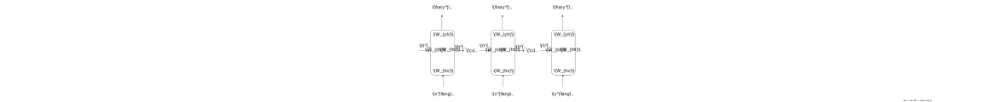

## Unsorted notes

---

- Judgment among training algorithms:

  It's more consistent to make judgment about different training algorithms or neural networks based on larger training set

- Three main factors of deep learning process

  - Scale of the training data
  - Speed of computation
  - Efficiency of the algorithm

## Perceptrons

---

There is a book named *Neural Networks and Deep Learning*  that gives an intuitive idea of (sigmoid) percoeptrons:

- For quick reviewing, see  [Warm up: a fast matrix-based approach to computing the output from a neural network](http://neuralnetworksanddeeplearning.com/chap2.html#warm_up_a_fast_matrix-based_approach_to_computing_the_output_from_a_neural_network).
- For more a comprehensive understanding, see [Using neural nets to recognize handwritten digits](http://neuralnetworksanddeeplearning.com/chap1.html)

Notes from Nielsens's book :



- Perceptrons
  - can [mimic the NAND gate](http://neuralnetworksanddeeplearning.com/chap1.html#perceptrons), so it is as powerful as any other computing device.
  - But **small change in weight may cause huge corresponding change (even completely flip) in the output**.
- Sigmoid perceptrons
  - have the same expressiveness as perceptrons do
  - except that sigmoid perceptrons are smooth and therefore have the desired property that we can choose **small changes in the weights and bias to achieve small change in the output**.
  - And sigmoid perceptrons have lovely properties when differentiated.



### Terminologies and Notations

#### Terminologies

Input layer
: The leftmost layer in a network.

Input neurons
: The neurons within the input layer.

Output layer
: The rightmost layer in a network.

Output neurons
: The neurons within the output layer.

Hidden layer
: It means nothing more than “not an input or an output layer”.

MLPs (Multilayer perceptrons)
: Networks that are made up of sigmoid neurons (not perceptrons).

Feedforward neural networks
: Neural networks in which the output from one layer is used as the input to the next layer (no loops in the network)

Epoch
: When all the training inputs are fed, it is said to complete an epoch of training.

#### Notations

$w^L\_{jk}$
: Weight of a connection between two layers  
It's the weight for the connection from the $k^{\operatorname{th}}$ neuron in the $(L-1)^{\operatorname{th}}$ to the $j^{\operatorname{th}}$ neuron in the $L^{\rm th}$ layer.

$w^L$
: Weight matrix of connections between two layers  
It's the weight matrix in which the entry at $j^{\rm th}$ row and $k^{\rm th}$ column is $w^L\_{jk}$.

$b^L\_j$
: Bias  
It's the bias of the $j^{\rm th}$ neuron $L^{\rm th}$ layer.

$b^L$
: Bias vector  
It's the bias vector in the $L^{\rm th}$ layer.

$a^L\_j$
: Activation  
It is the activation of the $j^{\rm th}$ neuron in the $L^{\rm th}$ layer.

  $$
  \begin{equation*}
  a^{L}_j = \sigma\left( \sum_k w^{L}\_{jk} a^{L-1}\_k + b^L\_j \right)
  \end{equation*}
  $$

  where $k$ ranges over all the neurons in the $(L-1)^{\rm th}$

$\sigma$
: Activation function, e.g., sigmoid function:

  $$
  \begin{equation*}
  \sigma (z) = \frac{1}{1 + e^{-z}}
  \end{equation*}
  $$

$a^L$
: Activation vector

  $$
  \begin{equation*}
  a^L = \sigma(w^L a^{L-1} + b^L)
  \end{equation*}
  $$

  vectorization of $\sigma$ (the sigmoid function) occurs here

$z^l$
: The weighted input vector
It is the intermediate quantity of $a^L$

  $$
  \begin{equation*}
    z^L = w^L a^{L-1} + b^L
  \end{equation*}
  $$

  and

  $$
  \begin{equation*}
  z^L\_j = \sum\_k w^L\_{jk} a^{L-1}\_k + b^L\_j
  \end{equation*}
  $$

$\odot$
: Handamard product  
If $A, B$ both are $m \times n$ matrices, then

  $$
  (A \odot B)\_{ij} = (A)\_{ij} (B)\_{ij}
  $$

### Gradient descent

The aim of the training algorithm is to minimize the cost $C(w,b)$ by an algorithm known as gradient descent:

#### Cost function

It's a function $C(w,b)$ of weights and biases that is used to judge the performance of a model. For example:



- Individual cost for example $x$:

  $$
  \begin{equation*}
    C_x \equiv \frac{1}{2} \\| y(x) - a \\|^2
  \end{equation*}
  $$

- Average costs

  $$
  \begin{equation*}
    C(w,b) \equiv \frac{1}{2n} \sum_x \\| y(x) - a\\|^2 \tag{MSE}
  \end{equation*}
  $$



Notes from Nielsens's book :



Necessary properties:

- The cost function will be close to zero if the neuron's ouput is close to the desired output.
- The cost function is always non-negative.
- Small change in the weigths and biases can cause small change of corresponding cost function. Other standards like the number of images correctly classified is not a smooth function like quadratic cost.

Assumptions:

1. The cost function can be written as an average $C = \frac{1}{n} \sum\_x C\_x$ over cos functions $C\_x$ for individual training examples, $x$. ([Why?](http://neuralnetworksanddeeplearning.com/chap2.html#the_two_assumptions_we_need_about_the_cost_function))
2. The cost can be written as a function of the outputs from the neural network: $\operatorname{cost} C = C(a^L)$, where $a^L$ is the activation vector of the output layer.



#### Algorithm

Calculus tells us that $C$ changes as follows:

$$
\begin{equation*}
  \Delta C \approx \nabla C \cdot [\Delta w, \Delta b] \tag{AP}
\end{equation*}
$$

where

$$
\begin{equation*}
\nabla C = [\frac{\partial C}{\partial w}, \frac{\partial C}{\partial b}].
\end{equation*}
$$

Since we want $\Delta C$ to be negative, there fore we can let $[\Delta w, \Delta b]$ change like this:

$$
\begin{equation*}
  [\Delta w, \Delta b] = - \eta \Delta C.
\end{equation*}
$$

where $\eta$ is a small, positive parameter (known as the learning rate). And this choice can guarantee $\Delta \leq 0$, which makes sure that $C$ will always decrease:

$$
[w, b] \rightarrow [w\', b\'] = [w, b] - \eta \Delta C.
$$

We can think this update rule as defining the gradient descent algorithm.

In practice, we can use stochastic gradient descent (see [Equation \$ \rm SGD\$](#eqn-SGD)) instead of gradient descent for sake of speed:


For a set $X$ of training input, randomly choose sets of training inputs $X_1, X_2, ..., X_m$ ($X_i \cap X_j = \varnothing$ and $\bigcap\_i X_i = X$), ($X\_i$ is called mini-batch) we have:

$$
\begin{equation*}
\frac{\sum_{j=1}^m \nabla C_{X_{j}}}{m} \approx \frac{\sum_x \nabla C_x}{n} = \nabla C. \tag{SGD}
\end{equation*}
$$



$$
\begin{equation*}
  w_k \rightarrow w_k\' = w_k-\frac{\eta}{m} \sum_j \frac{\partial C_{X_j}}{\partial w_k} \tag{MB1}
\end{equation*}
$$

$$
\begin{equation*}
  b\_l  \rightarrow  b\_l\' = b\_l-\frac{\eta}{m} \sum\_j \frac{\partial C\_{X\_j}}{\partial b\_l}, \tag{MB2}
\end{equation*}
$$

where the sums are over all the training examples $X\_j$ in the current mini-batch.


This alogrithm that may not always find the global minimum of $C$.




- Small enough that [Equation \$ \rm AP\$](#eqn-AP) is a good approximation
- Not too small that gradient descent algorithm won't work very slowly.




We can mimic a real physical ball that will fall to minimum by gravity, but it is necessary to compute second partial derivatives of $C$ which is quite costy.




For the coefficients of [Equation \$ \rm MSE\$](#eqn-MSE):

- $\frac{1}{2}$ is for easy derivation.
- $\frac{1}{n}$ can be omitted especially when the total number of training examples isn't known in advance. Similarly for $\frac{1}{m}$ term for the mini-batch update rules [Equation \$ \rm MB1\$](#eqn-MB1) and [Equation \$ \rm MB2\$](#eqn-MB2).




Sophisticated algorithm $\leq$ simple learning algorithm $+$ good training data.


### Back propagation

The backpropagation algorithm needs computing the partial derivatives $\partial C / \partial w^L\_{jk}$ and $\partial C / \partial b^L\_j$. We can calculate an intermediate quantity: $\delta^L\_j$. We call it the error or the local gradient in the $j^{\rm th}$ neuron in the $L^{\rm th}$ layer.



- Forward propagation
  
  $$
  \begin{equation*}
  a^L = \sigma(w^L a^{L-1} + b^L)
  \end{equation*}
  $$

- Back propagation
  
  - Gradient vector: $\nabla C$,gradient vector of $C$
  
  $$
  \begin{equation*}
  \delta^L\_j = \frac{\partial C}{\partial a^L\_j} \sigma\'(z^L\_j) \tag{BP1}
  \end{equation*}
  $$

  $$
  \begin{equation*}
  \delta^L = ((w^{L+1})^T \delta^{L+1}) \odot \sigma\'(z^L) \tag{BP2}
  \end{equation*}
  $$
  
  $$
  \begin{equation*}
    \frac{\partial C}{\partial b^l\_j} = \delta^l\_j \tag{BP3}
  \end{equation*}
  $$
  
  $$
  \begin{equation*}
    \frac{\partial C}{\partial w^l\_{jk}} = a^{l-1}\_k \delta^l\_j \tag{BP4}
  \end{equation*}
  $$



Its basic idea is:

- Every partial derivatives $\partial C / \partial w^L\_{jk}$ and $\partial C / \partial b^L\_j$ can be computed by the error $\delta^L\_j$. (see Equation $\rm BP3$ and $\rm BP4$)
- Every error vector $\delta^L$ in the $L^{\rm th}$ layer (except output layer) can be computed by $\delta^{L+1}$. (see Equation $\rm BP2$)
- Every error in the output layer can be computed by Equation $\rm BP1$



- Weights output from low-activation neurons learn slowly: from Equation $\rm BP4$ we can see, if the activation of the neuron input to the weight $w$ is small, then $\partial C / \partial w$ will be small, we say the weight learns slowly.
- Weight in the final layer will learn slowly if the output neuron has saturated: see Equation $\rm BP1$, if the output neuron $\delta\ (z^L\_j)$ is either low activation ($\approx 0$) or high activation ($\approx 1$), then $\delta\' (z^L\_j)$ will be approximately $0$ or $1$. This will lead to low error ($\approx 0$) and therefore low change of weight.
- Similarly insights from earlier layers (see Equation $\rm BP2$)
- The proof of equations of backpropagation doesn't depend on the form of activation function. (see the [proof](http://neuralnetworksanddeeplearning.com/chap2.html#proof_of_the_four_fundamental_equations_(optional)))



Its algorithm is:

1. Input $x$: Set the corresponding activation $a^1$ for the input layer.
2. Feedforward: For each $l = 2,3,...,L$ compute $z^l = w^l a^{l-1} + b^l$ and $a^l = \sigma(z^l)$
3. Output error $\sigma^L$: Compute the vector $\delta^{L} = \nabla\_a C \odot \sigma\'(z^L) $
4. Backpropagate the error: For each $l = L - 1, L - 2, ..., 2$, compute $\delta^{l} = ((w^{l+1})^T \delta^{l+1}) \odot \sigma\'(z^{l})$
5. Output: The gradient of the cost function is given by $\frac{\partial C}{\partial w^l_{jk}} = a^{l-1}_k \delta^l_j$ and $\frac{\partial C}{\partial b^l_j} = \delta^l_j$

#### Proof of Convergence

T.B.D.

### Cost functions

Basic properties of cost functions (see this [section](#gradient-descent))

#### The cross-entropy cost function

From the equations of [back propagation](#back-propagation) we can infer that saturated output neuron will lead to low learning rate (see [this](http://neuralnetworksanddeeplearning.com/chap3.html#the_cross-entropy_cost_function)). We can define another cost function to eliminate the influence of the sigmoid function:



- Average cost for single-neuron output layer

  $$
  \begin{equation}
    C = -\frac{1}{n} \sum_k \left[y \ln a + (1-y ) \ln (1-a) \right] \tag{CE}
  \end{equation}
  $$

  where $z = \sum_k w\_{k} x\_k+b$

- Average cost for many-neuron output layer

  $$
  \begin{equation}
   C = -\frac{1}{n} \sum_j \sum_k \left[y_j \ln a^L_j + (1-y_j) \ln (1-a^L_j) \right]
  \end{equation}
  $$

  where $z\_j = \sum_k w\_{jk} x\_k+b\_j$



It's obviously that the cross-entropy meets the properties. Here is proof that cross-entropy cost function avoids the problem of learning slowing down (this proof assumes there is only one neuron in the output layer, it's the same for multiple-neuron condition):

(note that $a = \sigma(z)$, $z = \sum_k w\_k x\_k+b$, $\sigma(z) = 1/(1+e^{-z})$ and $\sigma\'(z) = \sigma(z)(1-\sigma(z)) $)

$$
\begin{align*}
\frac{\partial C}{\partial w\_k} &= \frac{\partial C}{\partial a} \frac{\partial a}{\partial w\_k} \\\\
&= -\frac{1}{n} \sum\_x \left( \frac{y }{\sigma(z)} -\frac{(1-y)}{1-\sigma(z)} \right) \frac{\partial \sigma}{\partial w\_k} \\\\
&= -\frac{1}{n} \sum\_x \left( \frac{y}{\sigma(z)} -\frac{(1-y)}{1-\sigma(z)} \right)\sigma\'(z) x\_k \\\\
&= \frac{1}{n} \sum\_x \frac{\sigma\'(z) x\_k}{\sigma(z) (1-\sigma(z))} (\sigma(z)-y) \\\\
&= \frac{1}{n} \sum_x x_k(\sigma(z)-y)
\end{align*}
$$

It tells that the learning rate is controlled by $\sigma(z) - y$, i.e., by the error in the output and the $\sigma\'(z)$ term gets canceled out.

#### Log-likelihood cost function

See [softmax section](#softmax).

### Softmax

Softmax is an approach to solve the problem of learning slowdown. Log-likelihood cost function with softmax output layer works like cross-entropy cost function with sigmoid output layer.

Softmax is the same as sigmoid layer except for the manipulation of the weighted inputs $z^L_j = \sum_{k} w^L_{jk} a^{L-1}_k + b^L_j$. The activation $a^L\_j$ of the $j^{\rm th}$ output neuron is:

$$
\begin{equation*}
a^L\_j = \frac{e^{z^L\_j}}{\sum\_k e^{z^L\_k}} \tag{Softmax}
\end{equation*}
$$

The output activations from Softmax layer can be thought of as a probability distribution (sum up to $1$ and all nonnegative)

$$
\begin{equation*}
  \sum_j a^L_j  =  \frac{\sum_j e^{z^L_j}}{\sum_k e^{z^L_k}} = 1
\end{equation*}
$$

If the output layer can be seen as a predict of a classification problem, the cost function is log-likelihood cost function is defined as:

$$
\begin{equation*}
  C \equiv - \operatorname{ln} a^L\_j
\end{equation*}
$$

where $a^L\_j$ is the activation output for the $j$-class which $y$ indicates, if the output layer is softmax:

$$
\begin{align*}
\frac{\partial C}{\partial b^L_j} & =  a^L_j-y_j, \\\\
\frac{\partial C}{\partial w^L_{jk}} & =  a^{L-1}_k (a^L_j-y_j).
\end{align*}
$$



- As a more general point of principle, softmax plus log-likelihood is worth using whenever you want to interpret the output activations as probabilities.





- Monotonicity: increasing $z^L\_j$ guaranteed to increase output activation $a^L\_j$ and will decrease all the other $a^L\_i, i \neq j$
- Non-locality of softmax: any particular output activation $a^L\_j$ depends on all the weighted inputs $z^L\_i$




Why "soft"?


### Regularization Methods

Overfitting: The point when the model fits too closely to the training set (learning the noise in the training set) and stops generalizing.

Regulation: the process of modifying a learning algorithm so as to prevent overfitting.


Large networks have the potential to be more powerful than small networks, and so this is an option we’d only adopt reluctantly.


#### Early Stopping

- The obvious way to prevent overfitting is to stop training when the accuracy on test data no longer improving. (But this is not necessarily a sign of overfitting)
- Validation-based early stopping: we can use hold out method: we split out part of the training data as validation data, and use the validation data to evaluate different trial choices of hyper-parameters.

#### Weight Decay

Weight decay or L2 regulation, its idea is to add an extra term to the cost function, a term called the regularization term:

$$
\begin{equation*}
C = C\_0 + \frac{\lambda}{2n} \sum_w w^2 \tag{L2R}
\end{equation*}
$$

The $\lambda$ is known as the regularization parameter.



Intuitively, the effect of regularization is to make the network prefers to learn small weights. Large weights will
only be allowed if they considerably improve the first part of the cost function. It can be viewed as a way of compromise:

- when $\lambda$ is small, the model prefers to minimize the original cost function
- when $\lambda$ is large, we prefer small weights





There is no rigor proof.

See [this](http://neuralnetworksanddeeplearning.com/chap3.html#why_does_regularization_help_reduce_overfitting)

In short, the smallness of the weights means that the behaviour of the network won't change too musch if we change a few random inputs here and there. That makes it difficult for a regularized network to learn the effects of local noise in the data.

A regularized network tends to learn what are seen often across the training set and is good at avoiding noise in the training set.


From Equation $\rm L2R$ we can derive that:

$$
\begin{align*}
    \frac{\partial C}{\partial w} & = \frac{\partial C\_0}{\partial w} +
  \frac{\lambda}{n} w \\\\
  \frac{\partial C}{\partial b} & = \frac{\partial C\_0}{\partial b}.
\end{align*}
$$

Then we can derive the gradient descent learning rule:

$$
\begin{align*}
  b  \rightarrow &\ b -\eta \frac{\partial C\_0}{\partial b} \\\\
  w  \rightarrow &\ w-\eta \frac{\partial C\_0}{\partial
    w}-\frac{\eta \lambda}{n} w \\\\
  & = \left(1-\frac{\eta \lambda}{n}\right) w -\eta \frac{\partial
    C\_0}{\partial w}
\end{align*}
$$

We can see that the rule for the biases doesn't change, but that for weights changes. The weight $w$ is rescaled by a factor $1 - \eta \frac{\lambda}{n}$, and this rescaling is referred to as weight decay.



Unregularized runs will occasionally get "stuck" by caught in local minima of the cost function while regularized runs have provided more easily replicable results.

Heuristically, the length of the weight vector is likely to grow for unregularized runs. This can lead large weight vector and get it stuck pointing in more or less the same direction since changes due to gradient descent only make tiny changes to the direction when the length is long.


#### Other techniques

- L1 regularization:
  
  $$
  \begin{equation*}
    C = C_0 + \frac{\lambda}{n} \sum_w |w|
  \end{equation*}
  $$

  Un like L2 regularization, in L1 regularization, the weights shrink by a constant amount toward 0 (see [this](http://neuralnetworksanddeeplearning.com/chap3.html#other_techniques_for_regularization)):

  $$
  \begin{equation*}
    w \rightarrow w-\frac{\eta \lambda}{n} \operatorname{sgn}(w) - \eta \frac{\partial C\_0}{\partial w}
  \end{equation*}
  $$

  In L2, the weights shrink by an amount which is proportional to $w$. There fore L1 shrinks less for large $|w|$.

  

  See [this blog](https://medium.com/analytics-vidhya/l1-vs-l2-regularization-which-is-better-d01068e6658c) and [this blog](https://neptune.ai/blog/fighting-overfitting-with-l1-or-l2-regularization).

  How to understand this quote:

  > The net result is that L1 regularization tends to concentrate the weight of the network in a relatively small number of high-importance connections, while the other weights are driven toward zero.
  

- Dropout

  In a process of forward-propagate and backpropagate, randomly (and temporarily) delete half the neurons in the hidden layers. And restore the dropout neurons and repeat the process.

  
  Heuristically, for every process of forward and backward, it's like training different neural network. So the dropout procedure is like averaging the effects of a very large number of different networks. The different networks may overfit in different ways, but it seems that the net effect of dropout will be reduce overfitting.

  Another heuristic explanation is that it reduces the complex co-adaptations of neurons and is forced to learn more robust features that are useful in conjunction with many different random subsets of the other neurons.
  

- Artificially expanding the training data

  More data lead to better generalizing performance. We can artificially modifies the training data (rotating pictures, add noises) to obtain more data.

### Weight initialization

The argument of the [effect of different ways in initializing weight and biases](http://neuralnetworksanddeeplearning.com/chap3.html#weight_initialization)

For every layer with $n\_{\rm in}$ input weights, we shall initializing those weights as Gaussian random variables with mean 0 and standard derivation $1/\sqrt{n\_{\rm in}}$. For futher discussion, see pages 14 and 15 of a 2012 [paper](http://arxiv.org/pdf/1206.5533v2.pdf) by Yoshua Bengio.

## Convolutional Neural Networks

T.B.D.

### Convolutional Layers

T.B.D.

### Pooling Layers

T.B.D.

#### Max pooling

T.B.D.

#### Average pooling

T.B.D.

---

## Recurrent Neural Network

Advantage:

Standard MLP is insufficient to deal with problems with sequence model (like NLP problems) because:

- Inputs and output may have different lengths in different examples, padding isn't a good solution.
- Features of a sequence may have strong relationship, simple MLP can't make full use of this information because features learned are not shared among different positions of sequences.
- The weight matrix of $MLP$ will be very large due to the encoding of features. For example of NLP, one-hot encodes features (i.e. words) as vectors, the vectors are usually very large due to the size of the chosen vocabulary.

Disadvantage:

1. Computation speed/efficiency: its sequential nature precludes parallelization within training examples .
2. Memory usage: more context information needs larger hidden states which leads to larger memory consumption.
3. Although there're improvements and tricks, the fundamental constraint of sequential computation, however, remains .

There is a trend that replaces RNN with CNN to avoid sequential computation :

> The goal of reducing sequential computation also forms the foundation of the Extended Neural GPU [16], ByteNet [18] and ConvS2S [9], all of which use convolutional neural networks as basic building block, computing hidden representations in parallel for all input and output positions.

### Sequential Models

#### Notation

- $x$: denotes an input sequence which consists of tokens. If $x$ is an example, then its tokens are its features.

  $$
  x = (x^{\langle t \rangle}\_1, \dots, x^{\langle T_x  \rangle})
  $$

  - $x^{\langle t \rangle}$: denotes the $t^{\rm th}$ token of the sequence $x$
  - $T_x$: denotes the length of the sequence $x$
  - $x^{(i)}$ denotes the $i^{\rm th}$ input sequence:

    $$
    x^{(i)} = (x^{(i) \langle t \rangle}\_1, \dots, x^{(i)\langle  T^{(i)}_x \rangle})
    $$
- $\hat y$ denotes the prediction sequence

  $$
  \hat y = (\hat y^{\langle t \rangle}\_1, \dots, \hat y^{\langle T_{\hat y}  \rangle})
  $$

  - $\hat y^{\langle t \rangle}$: denotes the $t^{\rm th}$ token of the sequence $\hat y$
  - $T_{\hat y}$: denotes the length of the sequence $\hat y$
  - $\hat y^{(i)}$ denotes the $i^{\rm th}$ input sequence

    $$
    {\hat y}^{(i)} = (\hat y^{(i) \langle t \rangle}\_1, \dots, \hat y^{(i)\langle  T^{(i)}_{\hat y} \rangle})
    $$
- $y^{\langle t \rangle}$ basically is the label corresponding to input $x^{\\langle t \rangle}$.

#### Encoding words

- One-hot encoding

  For a input sequence:

  $$
  \text{Harry Potter and Hermione Granger invented a new spell}
  $$

  and its representation $x$:

  $$
  \begin{align*}
  x = (x^{\langle 1 \rangle}, \dots, x^{\langle 9 \rangle})
  \end{align*}
  $$

  We choose a vocabulary of size $N$. If the $j^{\rm th}$ token is in the $k^{\rm th}$ position of the vocabulary, then we assign $x^{\langle j \rangle}$ a column vector $[0, ..., 1, ..., 0]^T \in \mathbb{R}^{N}$ with $k^{\rm th}$ element $1$ and all other elements $0$. For example, if $\text{Hermione}$ is in the $3^{\rm rd}$ position of a vocabulary of size $6$, then $x^{\langle 4 \rangle} = [0, 0, 1, 0, 0, 0]^T$.

### RNN Basics

Given input sequence $x = (x^{\langle 1 \rangle}, \dots, x^{\langle T_x \rangle})$, this simple RNN give its predict sequence $\hat y = (\hat y^{\langle 1 \rangle}, \dots, \hat y^{\langle T_{\hat y} \rangle})$:



- $h^{\langle t \rangle}$: output of the hidden layer of time step $t$
- $W\_{ab}$: a matrix that is used to convert quantity about $b$ to quantity about $a$
- $\sigma$: activation function



For every temp step $t$,

- The output $\hat y^{\langle t \rangle}$ is a function:

  $$
  \hat y^{\langle t \rangle} = \sigma (W\_{yh} h^{\langle t \rangle} + b\_{y})
  $$
  
  It is a function of $h^{\langle t \rangle}$ with parameter $W\_{yh}$ and $h_{y}$.

- And the output $h^{\langle t \rangle}$ of hidden layer of time step $t$:
  
  $$
  \begin{align*}
  h^{\langle 0 \rangle} &= p \tag{$t = 0$} \\\\
  h^{\langle t \rangle} &= \sigma (W\_{hh} h^{\langle t-1 \rangle} + W\_{hx} x^{\langle t \rangle} + b\_h) \tag{$t > 0$}
  \end{align*}
  $$

  It is a function of

  - output $h^{\langle t-1 \rangle}$ of previous hidden layer,
  - input $x^{\langle t \rangle}$ of current time step
  
  with parameters

  - initial $p$ for $h^{\langle 0 \rangle}$
  - weight matrix $W\_{hh}$
  - weight matrix $W\_{hx}$
  - bias $b_h$ of the hidden layer.

For every time step $t$, the prediction of the output only uses the information earlier. That is to say, the computation of output $y^{\langle t \rangle}$ has no knowledge about the input $x^{\langle s \rangle},\ s \gt t$.

#### Loss functions

Loss functions:

- Element-wise loss function

  $$
  \mathcal{L}^{\langle t \rangle} (\hat y ^{\langle t \rangle}, y ^{\langle t \rangle}) = \text{some type of loss function}
  $$
- Loss function for single example

  $$
  \mathcal{L}(\hat y, y) = \sum\_{t=1}^{T_y}  \mathcal{L}^{\langle t \rangle} (\hat y ^{\langle t \rangle}, y ^{\langle t \rangle})
  $$

#### Types of RNN

See this blog [*RNN – Architectural Types of Different Recurrent Neural Networks*](https://datahacker.rs/003-rnn-architectural-types-of-different-recurrent-neural-networks/)

- Many-to-many arch.

- Many-to-one arch.

- One-to-many arch.

- Encoder-decoder arch.

### Language Modelling

[I have many doubts about this video](https://www.bilibili.com/video/BV1pJ41127Q2?p=156)
[see this?](https://d2l.ai/chapter_recurrent-neural-networks/language-model.html#perplexity)

#### Markov Models

If we use basic probability rules to model a sequence of tokens, then the probability of a sequence $x_1, \dots, x_{T_x}$ is:

$$
P(x_1, x_2, \ldots, x_T) = \prod_{t=1}^{T_x} P(x_t  \mid  x_1, \ldots, x_{t-1}).
$$

But we can use $n^{\rm th}$ order Markov assumption instead to make approximations:

$$
P(x_1, x_2, \ldots, x_T) = \prod_{t=1}^{T_x} P(x_t  \mid  x_{t-1}, \ldots, x_{t-(n-1)}).
$$

That is to say, the $t^{\rm th}$ token was predict only on the $n-1$ previous tokens.

#### RNN Model

T.B.D.

### Improved RNNs

#### Gated Recurrent Unit

T.B.D.

#### Long Short Term Memory (LSTM)

see this blog [*Understanding LSTM Networks*](https://colah.github.io/posts/2015-08-Understanding-LSTMs/)

#### Bidirectional RNN

T.B.D.

#### Deep RNN

T.B.D.

---

## Transformer

Transformer have an encoder-decoder structure.

> Transformer is the first transduction model relying entirely on self-attention to compute representations of its input and output without using sequence aligned RNNs or convolution .


[youtube video 25:47](https://www.youtube.com/watch?v=nzqlFIcCSWQ)


- http://jalammar.github.io/illustrated-transformer/
- http://nlp.seas.harvard.edu/annotated-transformer/

### Encoder-decoder structure

Encoder maps an input sequence of symbol representations $(x\_1, \dots, x\_{n})$ to a sequence of continuous representations $\mathbf{z} = (z\_1, \dots, z\_{n})$.

Decoder, given $\mathbf{z}$ and previously generated symbols from decoder (if exists), generates an output sequence $(y\_1, \dots, y\_{m})$ of symbols one element at a time.

### Scaled Dot-Product Attention

Notations:

- $d_k$: dimension of the queries and keys
- $d_v$: dimension of the values

$$
\begin{equation*}
  \operatorname{Attention}(Q,K,V) = \operatorname{softmax}(\frac{QK^T}{\sqrt{d_k}})V
\end{equation*}
$$


In linear algebra, dot production tests the similarity of two vectors. If the product is zero, then they are orthogonal.


## Pre-training

### Word embedding

See this blog [Word Embeddings](https://lena-voita.github.io/nlp_course/word_embeddings.html).

#### The Skip-Gram Model

T.B.D.

#### Negative Sampling

T.B.D.

#### Global Vectors (GloVe)

T.B.D.

## Some Neural Networks

### LeNet-5

T.B.D.

### AlexNet

T.B.D.

### VGG

T.B.D.

### ResNet

T.B.D.

### NiN

T.B.D.

### Inception Network

T.B.D.

## Generalized Language Models



T.B.D., see this blog [Feature-based Transfer Learning vs Fine Tuning?](https://angelina-yang.medium.com/feature-based-transfer-learning-vs-fine-tuning-bc8fc348a33d) and this video [Transfer Learning](https://www.youtube.com/watch?v=yofjFQddwHE)?



### ELMo

- See this blog *Generalized Language Models* about [ELMo](https://lilianweng.github.io/posts/2019-01-31-lm/#elmo)
- Paper of ELMo .



In the paper of ELMo, they say:

> The top layer LSTM output, $\vec{h}^{LM}\_{k,L}$, is used to predict the next token $t_{k+1}$ with a Softmax Layer.

But how? As far as I know, the Softmax layer needs many weighted inputs (see [Equation \$ \rm Softmax\$](#eqn-Softmax)). But how can a single vector $\vec{h}^{LM}\_{k,L}$ can be used as a input of a Softmax layer?



- [Deep Contextualized Word Representations | AISC](https://www.youtube.com/watch?v=9JfGxKkmBc0)
- [ELMO, BERT, GPT](https://www.youtube.com/watch?v=UYPa347-DdE&list=PLJV_el3uVTsOK_ZK5L0Iv_EQoL1JefRL4&index=63)
- [Contextualized Word Representations](https://krayush.medium.com/contextualized-word-representations-5df54663323f)

### BERT

- See this video [*BERT 论文逐段精读【论文精读】*](https://www.youtube.com/watch?v=ULD3uIb2MHQ), it also tells you how to calculate the number of parameters in a model.
- Paper of BERT 



In the paper of BERT:

> We note that in the literature the bidirectional Transformer is often referred to as a “Transformer encoder” while the left-context-only version is referred to as a “Transformer decoder” since it can be used for text generation.



### GPT

- Paper of GPT 



BERT is pre-trained by cloze test and GPT is pre-trained by predicating?



### GPT-2

- Paper of GPT-2 

## Bibliography

Devlin et al., 2019 
: Devlin, J., Chang, M.-W., Lee, K., & Toutanova, K. (2019). BERT: Pre-training of Deep Bidirectional Transformers for Language Understanding. Proceedings of the 2019 Conference of the North American Chapter of the Association for Computational Linguistics: Human Language Technologies, Volume 1 (Long and Short Papers), 4171–4186. https://doi.org/10.18653/v1/N19-1423

Nielsen, 2015 
: Nielsen, M. A. (2015). Neural networks and deep learning (Vol. 25). Determination press San Francisco, CA, USA.

Peters et al., 2018 
: Peters, M., Neumann, M., Iyyer, M., Gardner, M., Clark, C., Lee, K., & Zettlemoyer, L. (2018). Deep Contextualized Word Representations. Proceedings of the 2018 Conference of the North American Chapter of           the Association for Computational Linguistics: Human Language           Technologies, Volume 1 (Long Papers), 2227–2237. https://doi.org/10.18653/v1/N18-1202

Radford & Narasimhan, 2018 
: Radford, A., & Narasimhan, K. (2018). Improving Language Understanding by Generative Pre-Training.

Radford et al., 2019 
: Radford, A., Wu, J., Child, R., Luan, D., Amodei, D., Sutskever, I., & others. (2019). Language models are unsupervised multitask learners. OpenAI Blog, 1(8), 9.

Vaswani et al., 2017 
: Vaswani, A., Shazeer, N., Parmar, N., Uszkoreit, J., Jones, L., Gomez, A. N., Kaiser, Ł., & Polosukhin, I. (2017). Attention is All you Need. Advances in Neural Information Processing Systems, 30. https://papers.nips.cc/paper_files/paper/2017/hash/3f5ee243547dee91fbd053c1c4a845aa-Abstract.html
